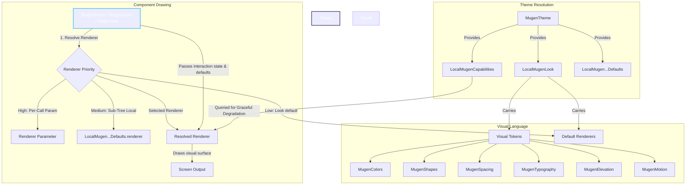

# Mugen Design System

> [!NOTE]
> **mugen** is currently a codename. The final name of the library may differ, but the architecture, interfaces, and concepts detailed below represent the library's core implementation design.

Mugen is a **Compose Multiplatform design library** where the entire visual language—colors, shapes, motion, typography, spacing, elevation, *and* per-component rendering—is swappable on the fly. 

Unlike traditional design libraries (e.g., Material Design or Cupertino) which hardcode component styling, Mugen decouples the **functional plumbing** of a component (state, accessibility, interactions) from its **visual drawing** (renderers). Swapping the active theme translates to a single state change that re-themes the entire subtree in a single Compose pass.

---

## 1. System Architecture

The following diagram illustrates how `MugenTheme` configures the environment and how a component resolves its tokens, capabilities, and renderer to draw itself.



---

## 2. Visual Tokens

Visual Tokens represent the abstract variables driving the look and feel. Every preset visual style (or `MugenLook`) must implement the following six token interfaces.

| Token Interface | Scale / Properties | Purpose |
| :--- | :--- | :--- |
| **`MugenColors`** | `primary`, `onPrimary`, `accent`, `onAccent`, `surface`, `onSurface`, `surfaceVariant`, `onSurfaceVariant`, `outline`, `danger`, `warning`, `success` | Core brand colors, surface container fills, outlines, and semantic feedback colors. |
| **`MugenShapes`** | `xs`, `sm`, `md`, `lg`, `xl`, `pill` | Semantic corner-radius scale mapping container shapes from smallest (tooltips) to largest (dialogs/sheets). |
| **`MugenSpacing`** | `none`, `xs`, `sm`, `md`, `lg`, `xl`, `xxl` | Layout margins and padding grids to maintain visual rhythm. |
| **`MugenTypography`** | `display{Large,Medium,Small}`, `title{Large,Medium,Small}`, `body{Large,Medium,Small}`, `label{Large,Medium,Small}` | Hierarchical text sizing and styling scale based on the Material-flavoured type system. |
| **`MugenElevation`** | `none`, `raised`, `floating`, `modal` | Semantic elevation intents. The active look determines the visual output (e.g., flat shadows, glows, or depth blurs). |
| **`MugenMotion`** | `fast`, `standard`, `slow` (Finite Specs)<br>`snappy`, `bouncy`, `gentle` (Spring Specs) | Animation specifications named by *intent* rather than millisecond duration, driving uniform motion dynamics. |

### Covariant Token Overrides

To avoid polluting the base token contracts with look-specific features (e.g., Haze's neon glow or Material's tonal overlay), Mugen uses **covariant property overrides**. Concrete Looks declare property overrides returning specialized sub-interfaces, exposing bespoke tokens to typed renderers:

```kotlin
// In Look-specific token classes
class HazeColors(...) : MugenColors {
    val glow: Color = Color(...)
    val shimmer: Color = Color(...)
}

// In HazeLook definition
class HazeLook(...) : MugenLook {
    override val colors: HazeColors // Covariant override returning HazeColors
}
```

---

## 3. Swappable Visual Presets (Looks)

Mugen ships with two distinct, built-in visual presets that showcase the system's flexibility.

### 1. Haze Look (`HazeLook`)
The signature visual language of the library. It features highly expressive, fluid, and modern aesthetics based on glassmorphic backdrops, glowing shadows, and organic morphing transitions.

> [!TIP]
> **HazeLook** is the default preset applied when invoking `MugenTheme()`.

* **Bespoke Tokens**:
  * `HazeColors.glow`: Outer glowing shadow color.
  * `HazeColors.shimmer`: Moving shimmer band color painted along container borders.
  * `HazeColors.hazeTint`: Fallback semi-opaque fill tint representing glass density.
  * `HazeColors.innerShadow`: Inner shadow tint punched in when pressed.
  * `HazeShapes.interactiveMorphRest`: Large rounded corner (100.dp / pill) representing an idle interactive component.
  * `HazeShapes.interactiveMorphActive`: Tight rounded corner (18.dp) morphed to on hover or press.
  * `HazeElevation.glowSpread` & `glowRadius`: Spread/blur controls for glowing shadow projection.
  * `HazeElevation.hazeBlur`: Blur radius applied behind glass layers.
  * `HazeMotion.shimmerSweep`: Slow sweep animation duration (5500ms) for border shimmers.
  * `HazeMotion.cornerMorph`: Low-stiffness spring driving corner animations on press.
  * `HazeMotion.glowPulse`: Responsive spring pulsing the outer glow alpha.

### 2. Material Look (`MaterialLook`)
A clean, flat, Material 3-flavoured visual language. It focuses on solid fills, standard shadow elevations, and scale-down press feedback. It is built as a set of Mugen renderers rather than a thin wrapper over Jetpack Compose Material 3, keeping it fully hot-swappable.

* **Bespoke Tokens**:
  * `MaterialColors.tonalSurface`: Surface fill used for elevated containers.
  * `MaterialColors.surfaceTint`: Tint overlaid on surface containers based on elevation.
  * `MaterialElevation.tonalNone` / `tonalRaised` / `tonalFloating` / `tonalModal`: Specific tonal overlay amounts mapping to M3 elevation tiers.

---

## 4. Decoupled Drawing Engine (Renderers)

Mugen decouples components into three distinct layers: **Components**, **States**, and **Renderers**.

```
  ┌─────────────────┐       Passes State       ┌──────────────────────┐
  │   MugenButton   ├─────────────────────────►│ MugenButtonRenderer  │
  └────────┬────────┘                          └──────────┬───────────┘
           │                                              │
     Reads │                                              │ Draws
           ▼                                              ▼
  ┌─────────────────┐                          ┌──────────────────────┐
  │  MugenButton    │                          │ Screen Output        │
  │  Defaults       │                          │ (Glass / Flat M3)    │
  └─────────────────┘                          └──────────────────────┘
```

### Components & State Resolution
UI components (`MugenButton`, `MugenCard`, `MugenText`) hold zero custom drawing logic. Instead, they:
1. Initialize a lightweight interaction tracker (e.g. `MugenButtonState`) using Compose's `MutableInteractionSource` to capture `isPressed`, `isHovered`, and `isFocused`.
2. Retrieve layout-specific properties from a defaults class (e.g., `MugenButtonDefaults` for heights, widths, and padding).
3. Query the renderer resolution chain to fetch the active `MugenButtonRenderer` and call its `Render()` block.

### Renderer Resolution Hierarchy
When a component is placed in the tree, it resolves which renderer to use according to the following priority chain:

1. **Per-Call Escape Hatch** *(Highest Priority)*:
   Passed directly via the `renderer` parameter on the component composable.
   ```kotlin
   MugenButton(onClick = {}, renderer = DebugOutlineButtonRenderer) { ... }
   ```
2. **Sub-Tree Defaults Override** *(Medium Priority)*:
   Provided using `CompositionLocalProvider` for a specific portion of the UI tree.
   ```kotlin
   CompositionLocalProvider(LocalMugenButtonDefaults provides customDefaults) { ... }
   ```
3. **Theme Look default** *(Lowest Priority)*:
   Determined by the active look in the global `MugenTheme` (e.g., `look.buttonRenderer`).

### Defaults & Overrides
Component-specific styling (such as default sizes, padding, and shapes) is packaged into immutable defaults classes: `MugenButtonDefaults`, `MugenCardDefaults`, and `MugenTextDefaults`. 

You can tweak these values globally using `MugenOverrides.build` when configuring the theme:
```kotlin
MugenTheme(
    look = MugenLooks.Material,
    overrides = MugenOverrides.build {
        button { it.copy(minHeight = 56.dp) }
    }
) {
    // Every MugenButton in this tree uses 56.dp minHeight
}
```

---

## 5. Platform Capabilities

To ensure Compose Multiplatform components run optimally across all targets without crashing, Mugen queries device capabilities and performs **graceful degradation**.

Visual features are evaluated on-device through `MugenCapabilities` and accessed via `LocalMugenCapabilities.current`:

```kotlin
data class MugenCapabilities(
    val supportsRuntimeShaders: Boolean, // AGSL shader compatibility
    val supportsBlur: Boolean,           // RenderEffect blur support
    val supportsInnerShadow: Boolean,    // Inner shadow rendering support
    val supportsHaze: Boolean,           // High-performance blur layers
    val deviceCornerRadius: Dp           // Physical screen corner curvature
)
```

### Target-Specific Resolution
Platform capability resolution is implemented via Compose `expect`/`actual` declarations across five target environments:

* **Android (`androidMain`)**: 
  * `supportsRuntimeShaders` is set to `true` on Android 13+ (API 33+ / Tiramisu).
  * `supportsBlur` and `supportsHaze` are set to `true` on Android 12+ (API 31+ / S).
  * `deviceCornerRadius` is dynamically read using `getRootWindowInsets()` and `getRoundedCorner()` on Android 12+.
* **iOS (`iosMain`)**: 
  * Full feature compatibility (`true` for shaders, blur, inner shadow, and haze) supported out of the box via Skia/Metal.
* **Desktop (`desktopMain`)**: 
  * Full feature compatibility via Skia JVM. Physical `deviceCornerRadius` is defaulted to `0.dp`.
* **Web (`jsMain` & `wasmJsMain`)**: 
  * Features are resolved according to web browser hardware acceleration support.

---

## 6. Roadmap: Phase B Haze Integration

Currently in **Phase A (indev01)**, a full glassmorphic background blur requires custom ambient state wiring by the developer. The next phase will introduce seamless visual blending:

* **Ambient Glass Context (`LocalMugenHazeContext`)**:
  A new `CompositionLocal` holding background pixels to allow renderers (like `HazeButtonRenderer`) to automatically capture the canvas backdrop.
* **Graceful Fallbacks**:
  When running on unsupported Android devices (below API 31) or web targets with hardware limitations, the renderer will automatically fall back from real-time glass blur to a semi-opaque backdrop (`colors.hazeTint`) without requiring code changes at call sites.
